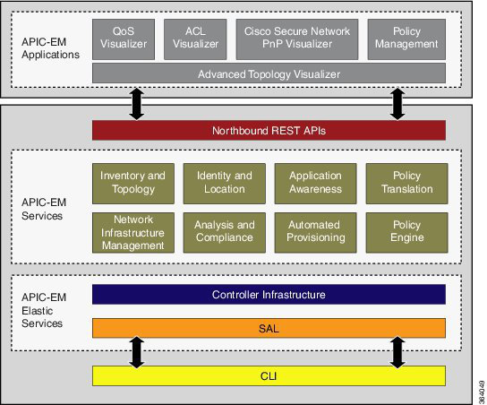
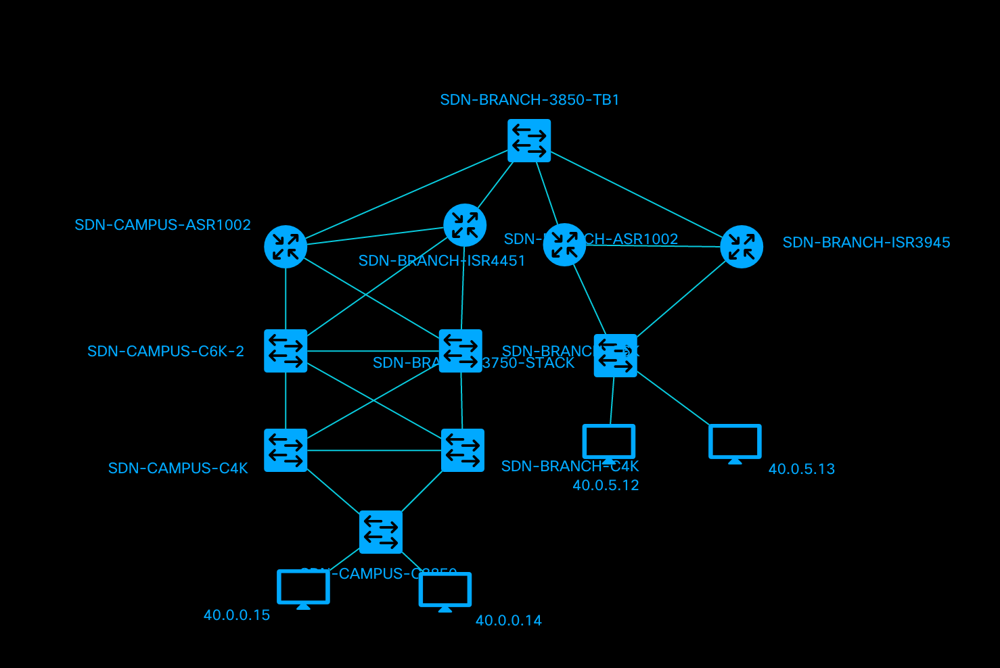

# Shipped APIC-EM and NextUI buildpack
Shipped is a hybrid devops framework that enables developer to easily build, deploy and run containerized microservices.

This repository include sample code and Shipped buildpack bootstrap data to enable developer to build and deploy application using Cisco APIC-EM APIs and NextUI visualization library.

## Buildpack
Buildpack github repository in Shipped is a pre-packged framework. This buildpack include following
- Sample application implementing some APIC-EM APIs.
- Sample web frontend implementing NextUI topology feature.
- Basic build, test and runtime scripts to build, test and run application.
- This repository in combination with APIC-EM buildpack defined in Shipped provide complete build and runtime environment details.

### APIC-EM

The Application Policy Infrastructure Controller (APIC) Enterprise Module (API) is a Software Defined Network (SDN) controller from Cisco. APIC-EM buildpack enable developer to build application using northbound APIs.

More details on APIC-EM development  https://developer.cisco.com/site/apic-em/

### NextUI

NeXt UI toolkit is an HTML5/JavaScript based toolkit for network web application. Provide high performance and high quality framework and network centric topology component.
Sample topology that this sample implements.

More details on NextUI toolkit : https://developer.cisco.com/site/NeXt-test/

##Sample Application & Code details

Sample Application accesses two cisco product APIs, one is APIC-EM and the other is NeXtUI to display the respective topologies. It is developed in simple HTML,CSS and JQuery which can be easily customized.

###Code Structure

The Sample application consists of following folder structure.
/bin -> Makes the Application executable
/server -> Node.js Server to host the application
/ui -> Consists of Core Sample Application.

We are consuming APIs from APIC-EM
https://sandboxapic.cisco.com this is the sandbox url for APIC-EM api.
As it is sandbox so anyone can access it, please login there with temporary user id and password mentioned on the same page.

You can extend our application by calling these sandbox APIs, like we did for Host API, Inventory API, Policy API etc.
Please follow the illustration below in order to understand the process of API consumption
- Navigate to the link for Host API call: https://github.com/CiscoCloud/shipped-apicem-bp/blob/master/ui/js/inventory/host.js
- We have created Parent functions to set host API data in UI dataTable,please follow the mentioned path 
    ui>js>util> ajaxUtils.js & tableUtils.js to bind and consume host API
- Pick minimal set of columns as done for sample API to show in GUI .
- Follow sample code to add links in html page.

We have few more API for topology.
- https://sandboxapic.cisco.com:443/api/v0/topology/physical-topology ,this api will provide us full physical topology of network system.
- https://sandboxapic.cisco.com/api/v0/routing-path/{Source IP}/{Destination IP} to get individual API call between two host, We need to use this api, just replace source and destination ip's.
Actually we are bypass our host ip address which we are getting from Host API call to this above API to generate the Host topology.

- To generate Topology we are using NeXt UI framework of cisco as you find the details in  ui>js>util> topologyUtils.js file.

###Note
- Topology will be available for Host. 
- To get Topology between two host IP, We need two choose source and destination IP address.
- To view full topology we need to go to Topology tab and click on "Show Full Topology" button.
- To get detail view of any API call, We need to check the last coloum which is view more detail option in each data table, to get complete view of that minimal list data.
